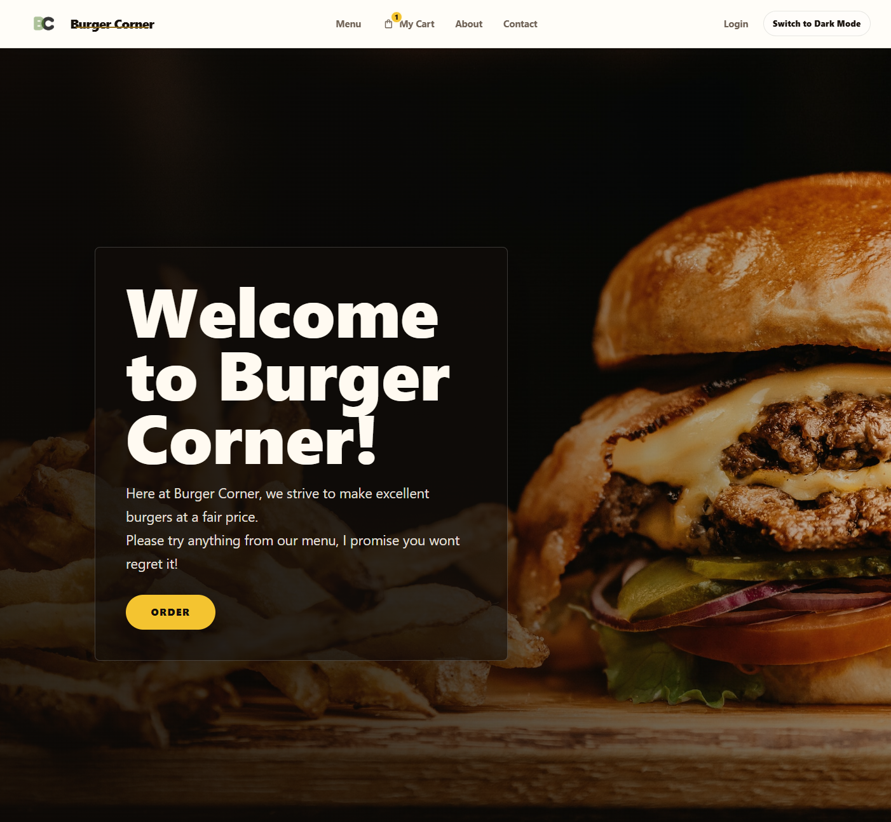
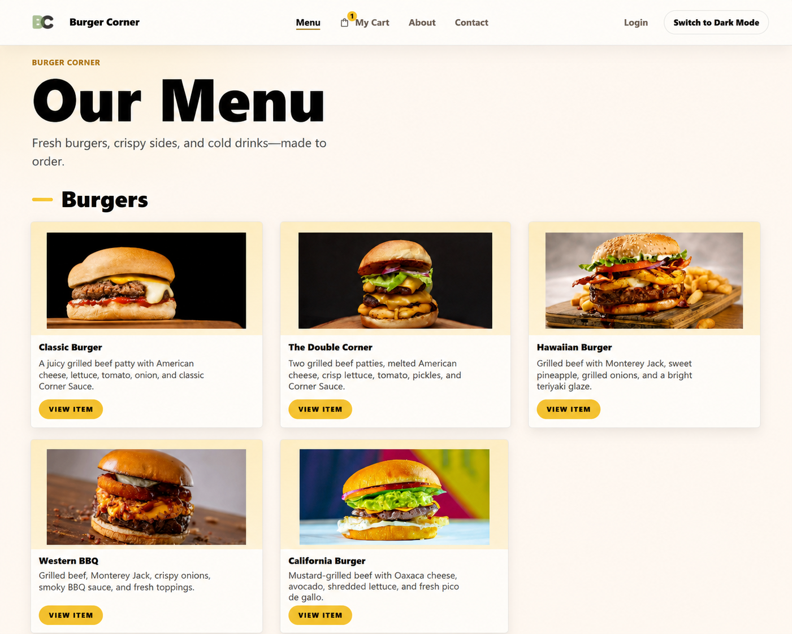
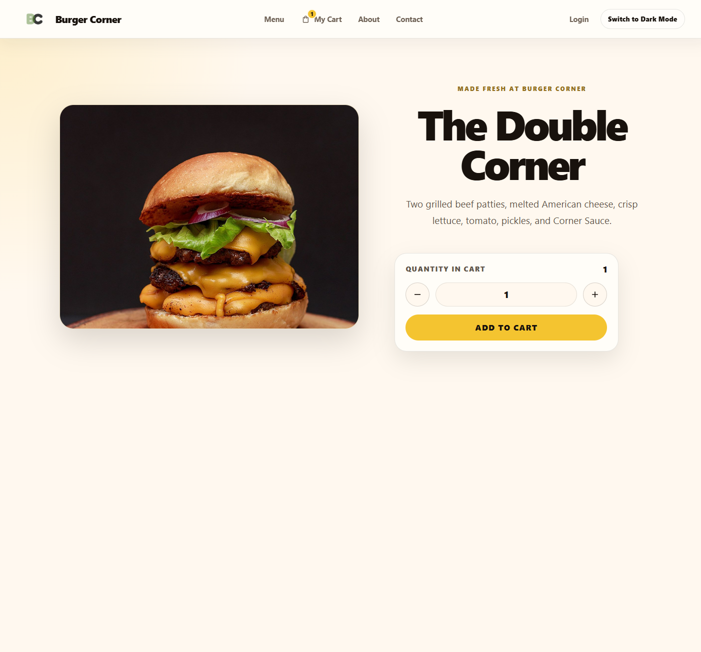
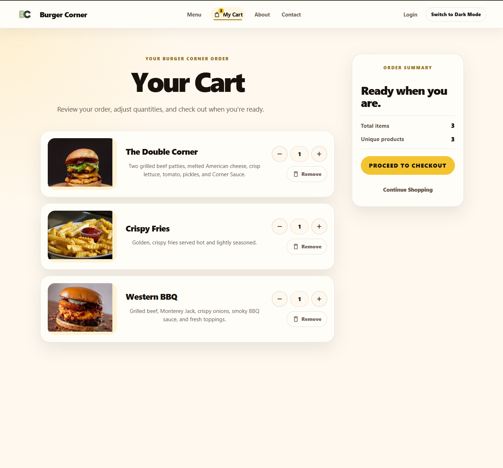

# Burger Corner

Next.js • React • JavaScript • Responsive Design

Burger Corner began as an early Next.js learning project and was later comprehensively modernized into a polished portfolio application. The goal was not to rebuild it from scratch, but to preserve the core functionality while improving the parts of the experience that users feel most: UI/UX, the shopping cart, responsive behavior, accessibility, and visual polish.

The modernization touched the parts of the app that matter most to a restaurant ordering experience: the homepage, menu, product detail page, shopping cart, and global navigation. It now presents a cohesive burger restaurant interface with production-style food photography, a redesigned cart flow, live cart feedback, and light/dark mode support.

This project belongs in my portfolio because it demonstrates practical frontend judgment: preserving existing functionality while improving usability, visual quality, accessibility, and maintainability.

## Project Highlights

The shopping cart received the most significant UX polish. Product images were made more prominent, cart rows were realigned, quantity controls were refined, and the order summary was redesigned to give users a clearer sense of their order before checkout. The navbar also includes a live cart badge, so cart state is visible throughout the app.

The homepage was redesigned around a stronger restaurant-first impression. A large editorial hero image, cleaner typography, better spacing, and a clearer call-to-action help the page feel more confident and food-focused while preserving the original content and route.

The menu was modernized into a responsive card-based experience that feels closer to a real restaurant website. Clearer category sections, stronger product names, concise descriptions, and production food photography make the menu easier to scan and more visually appealing without changing the underlying data structure.

The product detail page was rebuilt into a cleaner ecommerce-style view with large item photography, a focused product description, clear quantity controls, and a stronger Add to Cart action. The layout gives individual menu items more presence and makes the ordering step easier to understand.

Accessibility and technical cleanup were included throughout the process. Updates included more semantic page structure, keyboard-friendly controls, visible focus states, meaningful image alt text, dynamic cart labels, removal of stale comments, and cleanup of remaining lint issues.

## Features

- Responsive homepage with modern hero treatment
- Restaurant-style menu with category sections
- Product detail pages
- Shopping cart with quantity controls
- Live cart quantity badge in the navbar
- Add, decrease, and remove cart item actions
- Light and dark mode support
- Responsive layouts for desktop, tablet, and mobile
- Accessible navigation and interactive controls
- Production food photography
- Auth0 login/logout integration

## Screenshots

### Homepage



### Menu



### Product Detail



### Shopping Cart



## Tech Stack

- Next.js
- React
- JavaScript
- CSS Modules
- Sass / SCSS
- Bootstrap
- React Bootstrap
- Material UI Icons
- Auth0
- React Context API

## Installation

Clone the repository:

```bash
git clone https://github.com/jas2johns/burgercorner.git
cd burgercorner
```

Install dependencies:

```bash
npm install
```

Run the development server:

```bash
npm run dev
```

Open [http://localhost:3000](http://localhost:3000) in your browser.

Build for production:

```bash
npm run build
```

Auth0 login/logout routes require the appropriate local environment variables in `.env.local` if you want to test authentication locally.

## Project Structure

```text
components/       Reusable UI components such as the navbar and menu cards
context/          React Context providers for cart and theme state
data/             Menu data, image mapping, and data utilities
pages/            Next.js pages and API routes
public/           Static assets, logos, and menu photography
styles/           Global styles, Bootstrap customization, and CSS Modules
```

## Accessibility

Accessibility was improved throughout the modernization process with semantic HTML, keyboard-accessible controls, visible focus states, meaningful image alt text, responsive layouts, and dynamic labels for cart state.

This project is not presented as a formal accessibility audit, but accessibility was treated as an important part of the UI polish.

## Potential Future Enhancements

Potential future enhancements for Burger Corner include:

- Persistent cart storage
- User account dashboard
- Online ordering backend
- Payment integration
- Order history
- Favorite menu items

## License

A license has not yet been added to this project.

## Author

**Jason Johnson**

- GitHub: https://github.com/jas2johns
- Portfolio: https://jasonjohnson.me
